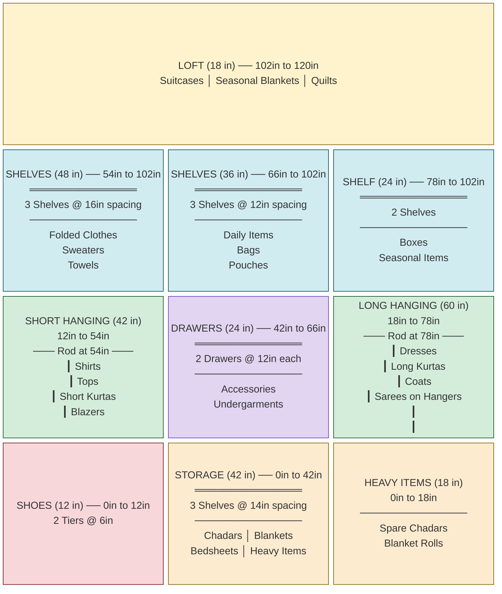
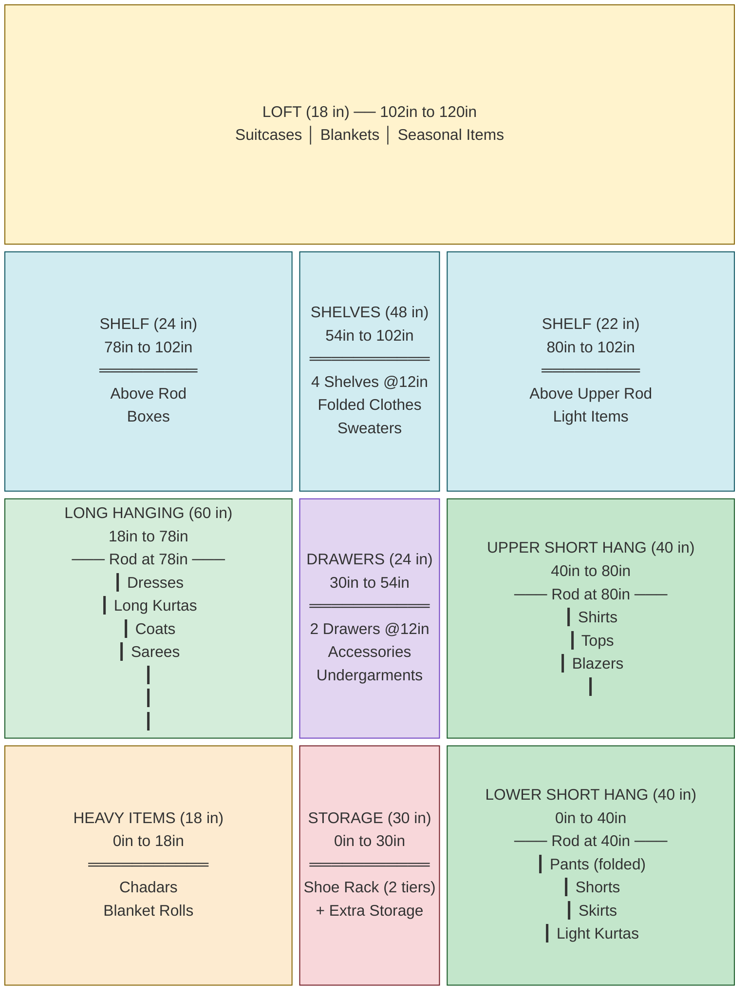
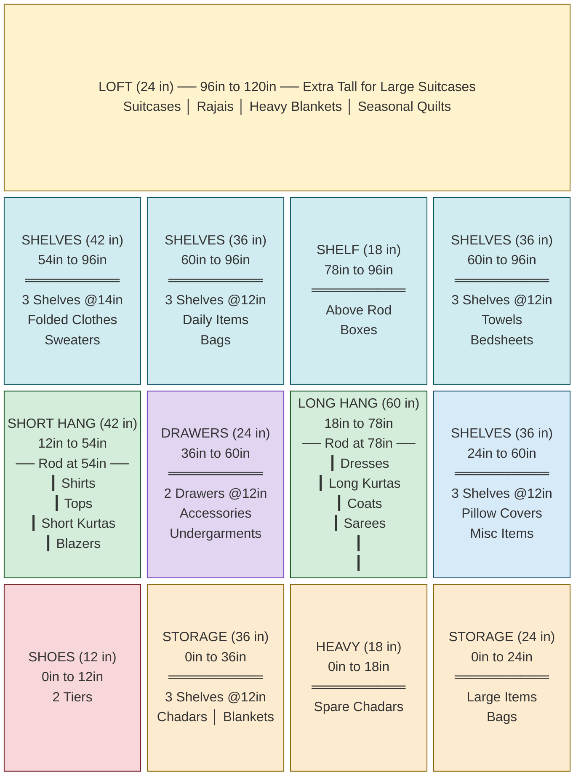

# Wardrobe Interior Design Blueprints

## Specifications

| Parameter | Value |
|-----------|-------|
| **Wardrobe Width** | 6.5 ft (78 inches) |
| **Wardrobe Height** | 10 ft (120 inches) floor-to-ceiling |
| **Recommended Depth** | 24 inches (standard for hanging clothes; hangers are 19-22 inches) |
| **Door Type** | 2-panel sliding doors (each panel ~39 inches wide) |
| **Number of Wardrobes** | 2 (identical, different rooms) |
| **User Height** | 5 ft 5 in (65 inches) |
| **Comfortable Reach** | ~78-80 inches (standing, arm raised) |
| **Step Stool Reach** | ~90-96 inches |

## Ergonomic Zones for a 5'5" Person

| Zone | Height Range | Access Level | Best For |
|------|-------------|--------------|----------|
| **Prime Zone** | 36" - 72" | Daily, effortless | Most-used clothes, drawers, everyday items |
| **Upper Zone** | 72" - 84" | Easy with arm raise | Hanging rods, frequently used shelves |
| **High Zone** | 84" - 102" | Needs slight stretch / step stool | Seasonal shelves, less-used items |
| **Loft Zone** | 102" - 120" | Needs step stool | Suitcases, heavy blankets, rajais |

## Hanging Space Guidelines

| Garment Type | Minimum Hanging Clearance | Recommended Rod Height |
|-------------|--------------------------|----------------------|
| Shirts, tops, short kurtas, blazers | 38-42 inches | 54 inches from floor |
| Dresses, long kurtas, coats, sarees on hangers | 55-60 inches | 78 inches from floor |

## Sliding Door Note

With 2 sliding panels, you can only access **one half (~39 inches)** of the wardrobe at a time. Designs below account for this -- related items are grouped so each accessible half remains functional.

## Material Thickness Note

Internal vertical dividers are typically 18mm (3/4 inch) plywood. The dimensions below are **zone dimensions** -- the carpenter should subtract divider thickness from the total width when cutting.

---

# DESIGN A: Classic Three-Column

**Philosophy:** Balanced layout with dedicated zones for every storage type. Short hanging, long hanging, shelves, drawers, and shoe storage all get their own space.

**Best for:** Someone who has a roughly equal mix of hanging clothes, folded clothes, and stored items.



### Design A -- Proportional Front View (ASCII Blueprint)

```
  Height
 (inches)  ←─────────────── 78 inches (6.5 feet) ──────────────────→

  120" ┌──────────────────────────────────────────────────────────────┐
       │                                                              │
       │           LOFT (18")  ──  Suitcases / Blankets / Quilts     │
       │                                                              │
  102" ├───────────────────┬───────────────────┬──────────────────────┤
       │                   │                   │                      │
       │   SHELVES (48")   │   SHELVES (36")   │   SHELF (24")       │
       │   3 shelves @16"  │   3 shelves @12"  │   2 shelves         │
       │                   │                   │   Boxes / Seasonal  │
       │   Folded Clothes  │   Daily Items     │                     │
   78" │   Sweaters        │   Bags            ├──────────────────────┤
       │   Towels          │                   │                      │
   66" │                   ├───────────────────┤   LONG HANGING (60") │
       │                   │                   │   Rod at 78"         │
       ├───────────────────┤   DRAWERS (24")   │   ┃                  │
   54" │ ════Rod@54════    │   2 drawers @12"  │   ┃ Dresses          │
       │                   │   Accessories     │   ┃ Long Kurtas      │
   42" │   SHORT HANGING   │   Undergarments   │   ┃ Coats            │
       │   (42")           ├───────────────────┤   ┃ Sarees           │
       │   Shirts          │                   │   ┃                  │
       │   Tops            │   STORAGE (42")   │   ┃                  │
       │   Short Kurtas    │   3 shelves @14"  │   ┃                  │
       │   Blazers         │   Chadars         │   ┃                  │
   18" │                   │   Blankets        ├──────────────────────┤
       │                   │   Bedsheets       │   HEAVY ITEMS (18")  │
   12" ├───────────────────┤   Heavy Items     │   Spare Chadars      │
       │   SHOES (12")     │                   │   Blanket Rolls      │
    0" └───────────────────┴───────────────────┴──────────────────────┘
        ←── LEFT (26") ──→  ←── CENTER (26") ─→  ←── RIGHT (26") ──→
```

### Design A -- Measurement Summary

| Zone | Column | Width | Height Range | Height | Contents |
|------|--------|-------|-------------|--------|----------|
| Loft | Full | 78" | 102"-120" | 18" | Suitcases, seasonal blankets, quilts |
| Shelves | Left | 26" | 54"-102" | 48" | 3 shelves: folded clothes, sweaters, towels |
| Short Hanging | Left | 26" | 12"-54" | 42" | Rod at 54": shirts, tops, short kurtas, blazers |
| Shoes | Left | 26" | 0"-12" | 12" | 2 tiers for shoes/slippers |
| Shelves | Center | 26" | 66"-102" | 36" | 3 shelves: daily items, bags, pouches |
| Drawers | Center | 26" | 42"-66" | 24" | 2 drawers: accessories, undergarments |
| Storage | Center | 26" | 0"-42" | 42" | 3 shelves: chadars, blankets, bedsheets |
| Shelf | Right | 26" | 78"-102" | 24" | 2 shelves: boxes, seasonal items |
| Long Hanging | Right | 26" | 18"-78" | 60" | Rod at 78": dresses, long kurtas, coats, sarees |
| Heavy Items | Right | 26" | 0"-18" | 18" | Spare chadars, blanket rolls |

### Design A -- Pros and Considerations

**Pros:**
- Every storage type has a dedicated zone
- Clean, organized layout with clear compartments
- 2 drawers for accessories and small items
- Shoe storage at bottom-left (easy to access)
- Center storage column ideal for heavy folded items (chadars at bottom, near waist height when bending)

**Considerations:**
- Only 26" of hanging rod per type -- may feel tight if you have lots of hanging clothes
- With sliding doors, the center column is partially accessible from both sides

---

# DESIGN B: Double-Hang Maximizer

**Philosophy:** Maximize hanging capacity. Left side handles long garments, right side has **double-tier short hanging** for 2x the shirts/tops capacity. A narrow center tower handles all folded storage.

**Best for:** Someone with many hanging garments -- lots of shirts, kurtas, dresses, formal wear.



### Design B -- Proportional Front View (ASCII Blueprint)

```
  Height
 (inches)  ←─────────────── 78 inches (6.5 feet) ──────────────────→

  120" ┌──────────────────────────────────────────────────────────────┐
       │                                                              │
       │          LOFT (18")  ──  Suitcases / Blankets / Seasonal    │
       │                                                              │
  102" ├─────────────────────────┬──────────────┬─────────────────────┤
       │                         │              │                     │
       │   SHELF (24")           │  SHELVES     │  SHELF (22")        │
       │   Above Rod             │  (48")       │  Above Upper Rod    │
   80" │   Boxes                 │  4 shelves   │  Light Items        │
   78" ├─────────────────────────┤  @12" each   ├─────────────────────┤
       │                         │              │                     │
       │   LONG HANGING (60")    │  Folded      │  UPPER SHORT        │
       │   Rod at 78"            │  Clothes     │  HANGING (40")      │
       │   ┃                     │  Sweaters    │  Rod at 80"         │
       │   ┃ Dresses             │              │  ┃ Shirts           │
   54" │   ┃ Long Kurtas         ├──────────────┤  ┃ Tops             │
       │   ┃ Coats               │              │  ┃ Blazers          │
       │   ┃ Sarees              │  DRAWERS     │  ┃                  │
   40" │   ┃                     │  (24")       ├─────────────────────┤
       │   ┃                     │  2 drawers   │                     │
   30" │   ┃                     │  Accessories │  LOWER SHORT        │
       │   ┃                     ├──────────────┤  HANGING (40")      │
       │   ┃                     │              │  Rod at 40"         │
   18" ├─────────────────────────┤  STORAGE     │  ┃ Pants (folded)   │
       │                         │  (30")       │  ┃ Shorts           │
       │   HEAVY ITEMS (18")     │  Shoe Rack   │  ┃ Skirts           │
       │   Chadars               │  + Extras    │  ┃ Light Kurtas     │
       │   Blanket Rolls         │              │  ┃                  │
    0" └─────────────────────────┴──────────────┴─────────────────────┘
        ←──── LEFT (30") ──────→  ←─ CTR (18") → ←─── RIGHT (30") ──→
```

### Design B -- Measurement Summary

| Zone | Column | Width | Height Range | Height | Contents |
|------|--------|-------|-------------|--------|----------|
| Loft | Full | 78" | 102"-120" | 18" | Suitcases, seasonal blankets |
| Shelf | Left | 30" | 78"-102" | 24" | Above rod: boxes, seasonal items |
| Long Hanging | Left | 30" | 18"-78" | 60" | Rod at 78": dresses, long kurtas, coats, sarees |
| Heavy Items | Left | 30" | 0"-18" | 18" | Chadars, blanket rolls |
| Shelves | Center | 18" | 54"-102" | 48" | 4 shelves: folded clothes, sweaters |
| Drawers | Center | 18" | 30"-54" | 24" | 2 drawers: accessories, undergarments |
| Storage | Center | 18" | 0"-30" | 30" | Shoe rack (2 tiers) + extra storage |
| Shelf | Right | 30" | 80"-102" | 22" | Above upper rod: light items |
| Upper Short Hang | Right | 30" | 40"-80" | 40" | Rod at 80": shirts, tops, blazers |
| Lower Short Hang | Right | 30" | 0"-40" | 40" | Rod at 40": pants, shorts, skirts |

### Design B -- Pros and Considerations

**Pros:**
- Maximum hanging capacity -- 3 rods total (1 long + 2 short)
- 30" wide hanging sections fit ~20-25 hangers each (60-75 garments on hangers total)
- Double-tier short hanging doubles your shirts/tops capacity
- Center tower keeps all folded items organized in one place

**Considerations:**
- Upper rod at 80" is reachable for 5'5" but needs a full arm raise
- Lower rod at 40" means bending slightly to access bottom garments
- Narrow center (18") limits shelf depth for large folded items
- Fewer shelves overall -- not ideal if you have many folded items

---

# DESIGN C: Sliding-Door Optimized (Two-Half)

**Philosophy:** Each half of the wardrobe is a **self-contained unit** aligned with the sliding door panels. When you open the left door, you get short hanging + drawers + shoes. When you open the right door, you get long hanging + extra shelves. No zone is split across the door boundary.

**Best for:** Maximum convenience with sliding doors. Each door slide gives complete access to a set of functions.



### Design C -- Proportional Front View (ASCII Blueprint)

```
  Height
 (inches)  ←─────────────── 78 inches (6.5 feet) ──────────────────→
           |←── LEFT HALF (39") ──→|←── RIGHT HALF (39") ─→|

  120" ┌──────────────────────────────────────────────────────────────┐
       │                                                              │
       │     LOFT (24")  ──  Suitcases / Rajais / Heavy Blankets     │
       │                                                              │
   96" ├─────────────┬───────────┬──────────────┬─────────────────────┤
       │             │           │              │                     │
       │  SHELVES    │  SHELVES  │  SHELF (18") │  SHELVES (36")      │
       │  (42")      │  (36")    │  Above Rod   │  Towels             │
       │  3@14"      │  3@12"    │  Boxes       │  Bedsheets          │
   78" │  Folded     │  Daily    ├──────────────┤                     │
       │  Clothes    │  Items    │              │                     │
   60" │  Sweaters   ├───────────┤  LONG HANG   ├─────────────────────┤
       │             │           │  (60")       │                     │
       ├─────────────┤  DRAWERS  │  Rod at 78"  │  SHELVES (36")      │
   54" │             │  (24")    │  ┃           │  Pillow Covers      │
       │  SHORT HANG │  2 drawers│  ┃ Dresses   │  Misc Items         │
       │  (42")      │  Access-  │  ┃ Long      │                     │
   36" │  Rod at 54" │  ories    │  ┃ Kurtas    ├─────────────────────┤
       │  ┃ Shirts   ├───────────┤  ┃ Coats     │                     │
       │  ┃ Tops     │           │  ┃ Sarees    │  STORAGE (24")      │
   24" │  ┃ Short    │  STORAGE  │  ┃           │  Large Items        │
       │  ┃ Kurtas   │  (36")    │  ┃           │  Bags               │
   18" │  ┃ Blazers  │  Chadars  ├──────────────┤                     │
       │  ┃          │  Blankets │  HEAVY (18") │                     │
   12" ├─────────────┤           │  Spare       │                     │
       │  SHOES(12") │           │  Chadars     │                     │
    0" └─────────────┴───────────┴──────────────┴─────────────────────┘
        Sub-A (22")  Sub-B (17")  Sub-C (22")    Sub-D (17")
        ←── LEFT HALF (39") ──→   ←── RIGHT HALF (39") ──→
```

### Design C -- Measurement Summary

| Zone | Sub-Section | Half | Width | Height Range | Height | Contents |
|------|-------------|------|-------|-------------|--------|----------|
| Loft | Full | Both | 78" | 96"-120" | 24" | Suitcases, rajais, heavy blankets, quilts |
| Shelves | Sub-A | Left | 22" | 54"-96" | 42" | 3 shelves: folded clothes, sweaters |
| Short Hanging | Sub-A | Left | 22" | 12"-54" | 42" | Rod at 54": shirts, tops, short kurtas |
| Shoes | Sub-A | Left | 22" | 0"-12" | 12" | 2 tiers for shoes/slippers |
| Shelves | Sub-B | Left | 17" | 60"-96" | 36" | 3 shelves: daily items, bags |
| Drawers | Sub-B | Left | 17" | 36"-60" | 24" | 2 drawers: accessories, undergarments |
| Storage | Sub-B | Left | 17" | 0"-36" | 36" | 3 shelves: chadars, blankets |
| Shelf | Sub-C | Right | 22" | 78"-96" | 18" | Above rod: boxes, light items |
| Long Hanging | Sub-C | Right | 22" | 18"-78" | 60" | Rod at 78": dresses, long kurtas, coats |
| Heavy Items | Sub-C | Right | 22" | 0"-18" | 18" | Spare chadars, extra blankets |
| Shelves | Sub-D | Right | 17" | 60"-96" | 36" | 3 shelves: towels, bedsheets |
| Shelves | Sub-D | Right | 17" | 24"-60" | 36" | 3 shelves: pillow covers, misc |
| Storage | Sub-D | Right | 17" | 0"-24" | 24" | Large items, bags |

### Design C -- Pros and Considerations

**Pros:**
- Each sliding door panel gives complete access to a self-contained half
- Left half: everyday quick-access (short hanging + drawers + shoes)
- Right half: less-frequent items (long hanging + linens + storage)
- Larger loft (24") fits large suitcases lying flat with room to spare
- 4 sub-sections give finer-grained organization

**Considerations:**
- Sub-B and Sub-D are only 17" wide -- tight for large folded items
- More vertical dividers = slightly more material cost
- The 24" loft reduces usable height below (96" vs 102" in other designs)

---

# Design Comparison

| Feature | Design A | Design B | Design C |
|---------|----------|----------|----------|
| **Short Hanging Rod Width** | 26" | 30" (x2 rods) | 22" |
| **Long Hanging Rod Width** | 26" | 30" | 22" |
| **Total Hanging Garments** | ~30-40 | ~60-75 | ~25-35 |
| **Number of Shelves** | ~9 | ~6 | ~12 |
| **Number of Drawers** | 2 | 2 | 2 |
| **Shoe Storage** | Yes (12") | Yes (in storage) | Yes (12") |
| **Loft Height** | 18" | 18" | 24" |
| **Sliding Door Alignment** | Partial | Partial | Full |
| **Best For** | Balanced needs | Heavy hanging needs | Sliding door convenience |

---

# Recommendations for the Carpenter

1. **Plywood:** Use 18mm (3/4") BWR (Boiling Water Resistant) grade plywood for structure. Use 12mm for shelves and 6mm for back panels.
2. **Shelf Pins:** Use adjustable shelf pin holes (32mm system) so shelves can be repositioned later.
3. **Hanging Rods:** Use oval steel/chrome rods (not round) -- they are stronger and prevent hangers from sliding.
4. **Drawer Slides:** Use telescopic ball-bearing slides (soft-close) for smooth operation.
5. **Sliding Door Track:** Use top-hung rollers (not bottom-track) to avoid dust accumulation and smoother operation.
6. **Internal Lighting:** Consider LED strip lights at the top of hanging sections -- greatly improves visibility.
7. **Depth:** Maintain 22-24 inches internal depth for hanging sections. Shelves can be 16-18 inches deep to leave a small gap behind for air circulation.

---

# Color Legend (for Mermaid Diagrams)

| Color | Zone Type |
|-------|-----------|
| Yellow | Loft (top storage) |
| Light Blue | Shelves (folded items) |
| Light Green | Hanging zones |
| Light Purple | Drawers |
| Light Pink | Shoe storage |
| Light Orange | Heavy/bottom storage |
