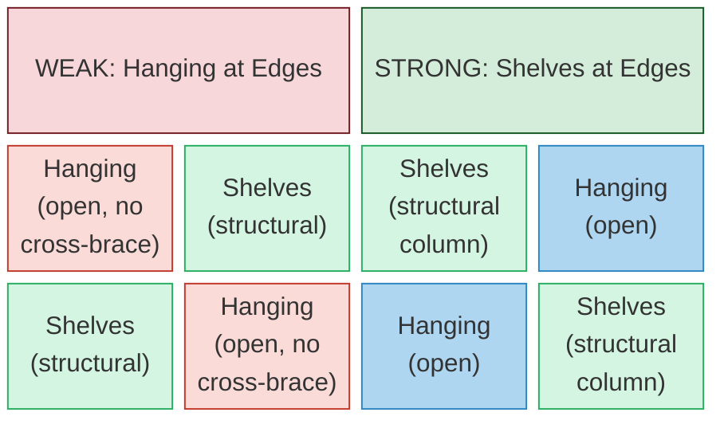
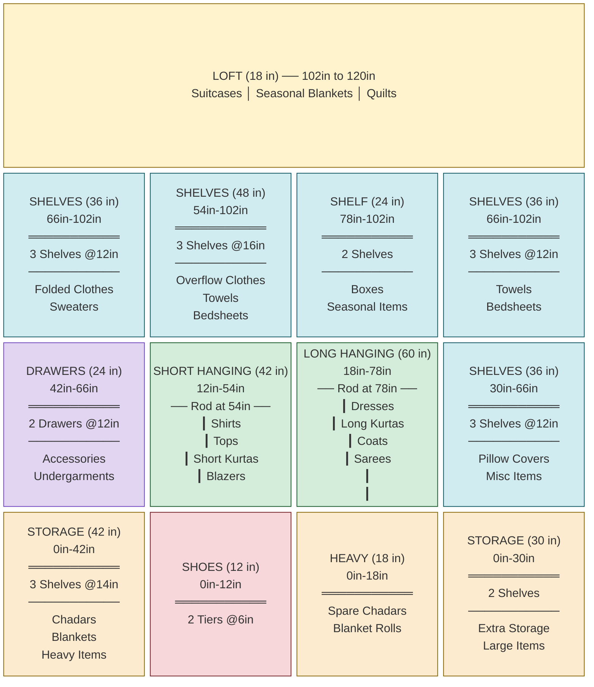
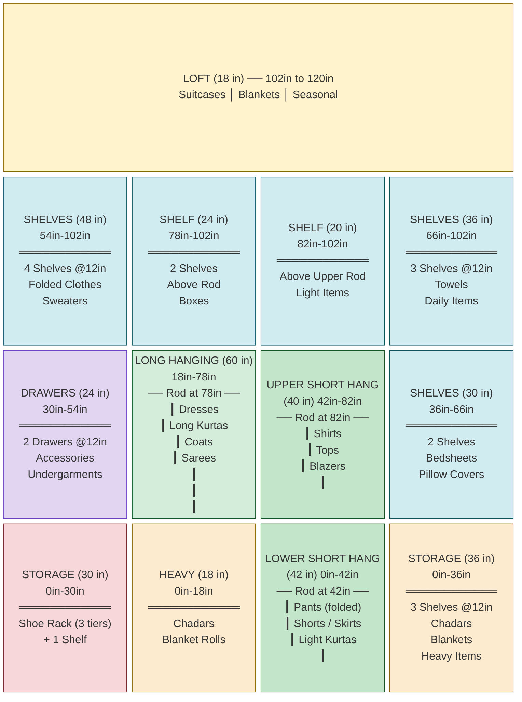
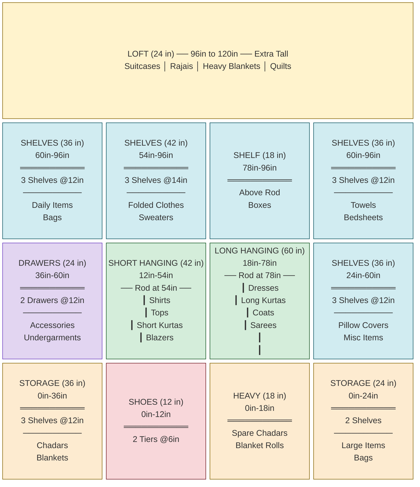

# Wardrobe Interior Design Blueprints (v2 -- Structural)

## Specifications

| Parameter | Value |
|-----------|-------|
| **Wardrobe Width** | 6.5 ft (78 inches) |
| **Wardrobe Height** | 10 ft (120 inches) floor-to-ceiling |
| **Recommended Depth** | 24 inches (standard for hanging; hangers are 19-22 inches) |
| **Door Type** | 2-panel sliding doors (each panel ~39 inches wide) |
| **Number of Wardrobes** | 2 (identical, different rooms) |
| **User Height** | 5 ft 5 in (65 inches) |
| **Comfortable Reach** | ~78-80 inches (standing, arm raised) |
| **Step Stool Reach** | ~90-96 inches |

## Ergonomic Zones for a 5'5" Person

| Zone | Height Range | Access Level | Best For |
|------|-------------|--------------|----------|
| **Prime Zone** | 36" - 72" | Daily, effortless | Most-used clothes, drawers, everyday items |
| **Upper Zone** | 72" - 84" | Easy with arm raise | Hanging rods, frequently used shelves |
| **High Zone** | 84" - 102" | Slight stretch / step stool | Seasonal shelves, less-used items |
| **Loft Zone** | 102" - 120" | Step stool required | Suitcases, heavy blankets, rajais |

## Hanging Space Guidelines

| Garment Type | Hanging Clearance Needed | Recommended Rod Height |
|-------------|--------------------------|----------------------|
| Shirts, tops, short kurtas, blazers | 38-42 inches | 54 inches from floor |
| Dresses, long kurtas, coats, sarees | 55-60 inches | 78 inches from floor |

---

## Core Structural Principle: Edge Towers + Center Hanging

All three designs below follow the same durability-first layout rule:



**Why this works:**

1. **Shelf towers on edges = structural columns.** Every horizontal shelf plank ties the two vertical panels of that section together, creating a rigid ladder-frame. This resists racking (side-to-side wobble) far better than an open hanging bay.
2. **Hanging sections in the center** are structurally lighter (open bays with just a rod). Placing them between two rigid edge towers means the weak sections are braced by strong ones on both sides.
3. **Loft shelf support:** With 3 internal vertical dividers (4 sections), the loft shelf is supported at 5 points across 78 inches (~every 19-20 inches). This eliminates any sag under heavy suitcases.
4. **Adjacent hanging rods** share a single central divider -- fewer parts, better load transfer, and the rod brackets screw into a divider that is sandwiched between structural towers.
5. **Bottom board** runs the full width connecting all sections at the base, completing the rigid frame.

## Material and Durability Notes

| Component | Specification | Why |
|-----------|--------------|-----|
| **Carcass (verticals + top/bottom)** | 18mm BWR plywood | Load-bearing structure |
| **Shelves** | 18mm BWR plywood | Heavy items (chadars, blankets); 12mm will sag over time |
| **Back panel** | 6mm MR plywood, pinned to EVERY shelf | Prevents racking; glue + pin nails at all shelf edges |
| **Hanging rods** | Oval chrome steel (not round) | Stronger under load; hangers don't slide freely |
| **Rod brackets** | Heavy-duty flanged brackets, 3 screws each | Must screw into 18mm vertical dividers, not into shelves |
| **Drawer slides** | Telescopic ball-bearing, soft-close | Smooth operation, durability |
| **Sliding door track** | Top-hung aluminium roller system | No bottom track = no dust trap, smoother glide |
| **Edge banding** | 1mm PVC or ABS on all exposed edges | Prevents moisture ingress into plywood layers |
| **Shelf pins** | 32mm system adjustable pins | Future flexibility to move shelves |

---

# DESIGN A: Structural Balanced

**Philosophy:** Equal-width shelf towers on both edges provide maximum structural rigidity and the most shelf/drawer space. Two equal hanging sections sit in the center -- short hang on one side, long hang on the other. The most balanced design across all storage types.

**Best for:** Someone with a roughly equal mix of hanging clothes, folded clothes, and stored items.



### Design A -- Proportional Front View (ASCII Blueprint)

```
  Height
 (inches)  ←────────────────── 78 inches (6.5 feet) ──────────────────→
            EDGE          CENTER-LEFT    CENTER-RIGHT         EDGE
           (structural)    (hanging)      (hanging)        (structural)

  120" ┌──────────────────────────────────────────────────────────────────┐
       │                                                                  │
       │           LOFT (18")  ──  Suitcases / Blankets / Quilts         │
       │                                                                  │
  102" ├────────────────┬────────────────┬────────────────┬───────────────┤
       │                │                │                │               │
       │  SHELVES (36") │ SHELVES (48")  │  SHELF (24")   │ SHELVES (36") │
       │  3 @12"        │ 3 @16"         │  2 shelves     │ 3 @12"        │
       │  Folded        │ Overflow       │  Boxes         │ Towels        │
       │  Clothes       │ Clothes        │  Seasonal      │ Bedsheets     │
   78" │  Sweaters      │ Towels         ├────────────────┤               │
       │                │ Bedsheets      │                │               │
   66" ├────────────────┤                │  LONG HANGING  ├───────────────┤
       │                ├────────────────┤  (60")         │               │
       │  DRAWERS (24") │                │  Rod at 78"    │ SHELVES (36") │
       │  2 @12"        │  SHORT HANGING │  ┃             │ 3 @12"        │
   54" │  Accessories   │  (42")         │  ┃ Dresses     │ Pillow Covers │
       │  Undergarments │  Rod at 54"    │  ┃ Long Kurtas │ Misc Items    │
   42" ├────────────────┤  ┃ Shirts      │  ┃ Coats       │               │
       │                │  ┃ Tops        │  ┃ Sarees      │               │
       │  STORAGE (42") │  ┃ Short       │  ┃             │               │
       │  3 @14"        │  ┃ Kurtas      │  ┃             ├───────────────┤
   30" │  Chadars       │  ┃ Blazers     │  ┃             │               │
       │  Blankets      │  ┃             │  ┃             │ STORAGE (30") │
       │  Heavy Items   │  ┃             │  ┃             │ 2 shelves     │
   18" │                │  ┃             ├────────────────┤ Extra Storage  │
       │                ├────────────────┤  HEAVY (18")   │ Large Items   │
   12" │                │  SHOES (12")   │  Spare Chadars │               │
       │                │  2 Tiers @6"   │  Blanket Rolls │               │
    0" └────────────────┴────────────────┴────────────────┴───────────────┘
        ← LEFT EDGE →   ← CTR-LEFT →    ← CTR-RIGHT →    ← RT EDGE →
           20 in            19 in            19 in            20 in
       ◄─ STRUCTURAL ─►  ◄──── HANGING (adjacent) ────►  ◄─ STRUCTURAL ─►
```

### Design A -- Measurement Summary

| Zone | Section | Width | Height Range | Height | Contents |
|------|---------|-------|-------------|--------|----------|
| Loft | Full width | 78" | 102"-120" | 18" | Suitcases, seasonal blankets, quilts |
| Shelves | Left Edge | 20" | 66"-102" | 36" | 3 shelves: folded clothes, sweaters |
| Drawers | Left Edge | 20" | 42"-66" | 24" | 2 drawers: accessories, undergarments |
| Storage | Left Edge | 20" | 0"-42" | 42" | 3 shelves: chadars, blankets, heavy items |
| Shelves | Center-Left | 19" | 54"-102" | 48" | 3 shelves: overflow clothes, towels, bedsheets |
| Short Hanging | Center-Left | 19" | 12"-54" | 42" | Rod at 54": shirts, tops, short kurtas, blazers |
| Shoes | Center-Left | 19" | 0"-12" | 12" | 2 tiers for shoes/slippers |
| Shelf | Center-Right | 19" | 78"-102" | 24" | 2 shelves: boxes, seasonal items |
| Long Hanging | Center-Right | 19" | 18"-78" | 60" | Rod at 78": dresses, long kurtas, coats, sarees |
| Heavy Items | Center-Right | 19" | 0"-18" | 18" | Spare chadars, blanket rolls |
| Shelves | Right Edge | 20" | 66"-102" | 36" | 3 shelves: towels, bedsheets |
| Shelves | Right Edge | 20" | 30"-66" | 36" | 3 shelves: pillow covers, misc |
| Storage | Right Edge | 20" | 0"-30" | 30" | 2 shelves: extra storage, large items |

**Structural integrity:** 3 internal dividers at 20", 39", 58" from left wall. Loft supported at 5 points across 78" (~every 16-20 inches). Both edge towers have 8+ horizontal planks each acting as cross-braces. Back panel pinned to all shelves completes the rigid box.

### Design A -- Pros and Considerations

**Pros:**
- Maximum shelf and drawer space of all three designs (20" wide edge towers)
- Both edge towers are fully structural -- the most rigid design
- 2 drawers in the prime ergonomic zone (42"-66")
- Heavy items (chadars, blankets) in the bottom-left edge -- easy to access while kneeling
- Hanging sections share the center divider (single shared structural member)

**Trade-offs:**
- Hanging sections are 19" each -- fits ~12-15 hangers per rod
- With sliding doors, the left door exposes Left Edge + Center-Left; right door exposes Center-Right + Right Edge -- each half has 1 structural tower + 1 hanging section (good balance)

---

# DESIGN B: Hanging Dominant with Edge Support

**Philosophy:** Maximize hanging capacity while keeping the wardrobe structurally sound. Narrow shelf towers on both edges provide the structural frame. Wide hanging sections in the center give room for a full long-hanging bay plus a double-tier short-hanging bay for 3 rods total.

**Best for:** Someone with lots of hanging garments -- many shirts, kurtas, dresses, formal wear. Fewer folded items.



### Design B -- Proportional Front View (ASCII Blueprint)

```
  Height
 (inches)  ←────────────────── 78 inches (6.5 feet) ──────────────────→
            EDGE          CENTER-LEFT    CENTER-RIGHT         EDGE
           (structural)    (hanging)      (hanging)        (structural)

  120" ┌──────────────────────────────────────────────────────────────────┐
       │                                                                  │
       │           LOFT (18")  ──  Suitcases / Blankets / Seasonal       │
       │                                                                  │
  102" ├─────────────┬──────────────────┬──────────────────┬──────────────┤
       │             │                  │                  │              │
       │ SHELVES     │  SHELF (24")     │  SHELF (20")     │ SHELVES      │
       │ (48")       │  Above Rod       │  Above Upper     │ (36")        │
       │ 4 @12"      │  Boxes           │  Rod             │ 3 @12"       │
   82" │             │                  ├──────────────────┤ Towels       │
       │ Folded      │                  │                  │ Daily Items  │
   78" │ Clothes     ├──────────────────┤  UPPER SHORT     │              │
       │ Sweaters    │                  │  HANGING (40")   │              │
       │             │  LONG HANGING    │  Rod at 82"      │              │
   66" │             │  (60")           │  ┃ Shirts        ├──────────────┤
       │             │  Rod at 78"      │  ┃ Tops          │              │
       │             │  ┃               │  ┃ Blazers       │ SHELVES      │
   54" ├─────────────┤  ┃ Dresses       │  ┃               │ (30")        │
       │             │  ┃ Long Kurtas   │  ┃               │ 2 shelves    │
       │ DRAWERS     │  ┃ Coats         ├──────────────────┤ Bedsheets    │
       │ (24")       │  ┃ Sarees        │                  │ Pillow       │
   42" │ 2 @12"      │  ┃               │  LOWER SHORT     │ Covers       │
       │ Accessories │  ┃               │  HANGING (42")   │              │
   36" │ Undergar-   │  ┃               │  Rod at 42"      ├──────────────┤
       │ ments       │  ┃               │  ┃ Pants         │              │
   30" ├─────────────┤  ┃               │  ┃ Shorts        │ STORAGE      │
       │             │  ┃               │  ┃ Skirts        │ (36")        │
       │ STORAGE     │  ┃               │  ┃ Light Kurtas  │ 3 @12"       │
       │ (30")       │  ┃               │  ┃               │ Chadars      │
   18" │ Shoe Rack   ├──────────────────┤  ┃               │ Blankets     │
       │ (3 tiers)   │                  │  ┃               │ Heavy Items  │
       │ + 1 shelf   │  HEAVY (18")     │  ┃               │              │
       │             │  Chadars         │  ┃               │              │
       │             │  Blanket Rolls   │  ┃               │              │
    0" └─────────────┴──────────────────┴──────────────────┴──────────────┘
        ← L.EDGE →   ←── CTR-LEFT ──→   ←── CTR-RIGHT ─→  ← R.EDGE →
          15 in            24 in              24 in           15 in
       ◄ STRUCTURAL ►  ◄────── HANGING (adjacent) ──────►  ◄ STRUCTURAL ►
```

### Design B -- Measurement Summary

| Zone | Section | Width | Height Range | Height | Contents |
|------|---------|-------|-------------|--------|----------|
| Loft | Full width | 78" | 102"-120" | 18" | Suitcases, seasonal blankets |
| Shelves | Left Edge | 15" | 54"-102" | 48" | 4 shelves: folded clothes, sweaters |
| Drawers | Left Edge | 15" | 30"-54" | 24" | 2 drawers: accessories, undergarments |
| Storage | Left Edge | 15" | 0"-30" | 30" | Shoe rack (3 tiers @10") + 1 extra shelf |
| Shelf | Center-Left | 24" | 78"-102" | 24" | 2 shelves above rod: boxes, seasonal |
| Long Hanging | Center-Left | 24" | 18"-78" | 60" | Rod at 78": dresses, long kurtas, coats, sarees |
| Heavy Items | Center-Left | 24" | 0"-18" | 18" | Chadars, blanket rolls |
| Shelf | Center-Right | 24" | 82"-102" | 20" | Above upper rod: light items |
| Upper Short Hang | Center-Right | 24" | 42"-82" | 40" | Rod at 82": shirts, tops, blazers |
| Lower Short Hang | Center-Right | 24" | 0"-42" | 42" | Rod at 42": pants, shorts, skirts, light kurtas |
| Shelves | Right Edge | 15" | 66"-102" | 36" | 3 shelves: towels, daily items |
| Shelves | Right Edge | 15" | 36"-66" | 30" | 2 shelves: bedsheets, pillow covers |
| Storage | Right Edge | 15" | 0"-36" | 36" | 3 shelves: chadars, blankets, heavy items |

**Structural integrity:** Edge shelf towers at 15" wide -- narrower than Design A but still fully structural (7+ horizontal planks per edge tower). The 48" combined center hanging section is braced on both sides. Loft supported at 5 points.

**Rod note:** Upper short-hang rod at 82" requires a full arm raise for a 5'5" person. Comfortable but at the limit. If this feels high, lower it to 78" (reducing upper hanging clearance to 36" -- fine for t-shirts and polos).

### Design B -- Pros and Considerations

**Pros:**
- 3 hanging rods total: 1 long (24") + 2 short (24" each) = 72" of total rod length
- Fits ~50-60 garments on hangers (nearly double Design A)
- Double-tier short hanging gives separate zones for shirts (upper) and pants/shorts (lower)
- Wide 24" hanging bays fit hangers with plenty of breathing room
- Edge towers brace the entire structure even though center is mostly open

**Trade-offs:**
- Edge towers at 15" are narrow -- only fits smaller folded items or stacked clothes
- Fewer total shelves than Design A or C
- Upper rod at 82" is at the reach limit for 5'5" -- consider lowering to 78" if preferred
- Not optimized for sliding door halves (center hanging spans both door panels)

---

# DESIGN C: Smart Halves (Sliding-Door + Edge Support)

**Philosophy:** Combines the structural edge-tower approach with sliding-door optimization. Each half of the wardrobe (aligned to a door panel) contains one edge shelf tower + one hanging section. Hanging sections are adjacent in the center. Every door slide gives you a complete set of storage.

**Best for:** Maximum daily convenience with sliding doors, plus structural durability. The recommended design for most people.



### Design C -- Proportional Front View (ASCII Blueprint)

```
  Height
 (inches)  ←────────────────── 78 inches (6.5 feet) ──────────────────→
           |←── LEFT HALF (39") ──→|←── RIGHT HALF (39") ──→|
            EDGE          INNER-LEFT    INNER-RIGHT        EDGE
           (structural)    (hanging)      (hanging)      (structural)

  120" ┌──────────────────────────────────────────────────────────────────┐
       │                                                                  │
       │      LOFT (24")  ──  Suitcases / Rajais / Heavy Blankets        │
       │                                                                  │
   96" ├─────────────┬────────────────┬────────────────┬──────────────────┤
       │             │                │                │                  │
       │ SHELVES     │ SHELVES (42")  │  SHELF (18")   │ SHELVES (36")    │
       │ (36")       │ 3 @14"         │  Above Rod     │ 3 @12"           │
       │ 3 @12"      │ Folded         │  Boxes         │ Towels           │
   78" │ Daily Items │ Clothes        ├────────────────┤ Bedsheets        │
       │ Bags        │ Sweaters       │                │                  │
   60" ├─────────────┤                │  LONG HANGING  ├──────────────────┤
       │             ├────────────────┤  (60")         │                  │
       │ DRAWERS     │                │  Rod at 78"    │ SHELVES (36")    │
       │ (24")       │  SHORT HANGING │  ┃             │ 3 @12"           │
   54" │ 2 @12"      │  (42")         │  ┃ Dresses     │ Pillow Covers    │
       │ Accessories │  Rod at 54"    │  ┃ Long Kurtas │ Misc Items       │
       │ Undergar-   │  ┃ Shirts      │  ┃ Coats       │                  │
   36" │ ments       │  ┃ Tops        │  ┃ Sarees      │                  │
       ├─────────────┤  ┃ Short       │  ┃             ├──────────────────┤
       │             │  ┃ Kurtas      │  ┃             │                  │
       │ STORAGE     │  ┃ Blazers     │  ┃             │ STORAGE (24")    │
   24" │ (36")       │  ┃             │  ┃             │ 2 shelves        │
       │ 3 @12"      │  ┃             │  ┃             │ Large Items      │
       │ Chadars     │  ┃             │  ┃             │ Bags             │
   18" │ Blankets    │  ┃             ├────────────────┤                  │
       │             │  ┃             │  HEAVY (18")   │                  │
   12" │             ├────────────────┤  Spare Chadars │                  │
       │             │  SHOES (12")   │  Blanket Rolls │                  │
    0" └─────────────┴────────────────┴────────────────┴──────────────────┘
        ← L.EDGE →   ← INNER-LEFT →  ← INNER-RIGHT → ←── R.EDGE ──→
          15 in           24 in            24 in            15 in
       ◄ STRUCTURAL ► ◄───── HANGING (adjacent) ─────► ◄ STRUCTURAL ►
       |←── LEFT HALF (39") ───→|←─── RIGHT HALF (39") ──→|
       |  Slide LEFT door open  |  Slide RIGHT door open   |
```

### Design C -- Measurement Summary

| Zone | Section | Half | Width | Height Range | Height | Contents |
|------|---------|------|-------|-------------|--------|----------|
| Loft | Full width | Both | 78" | 96"-120" | 24" | Suitcases, rajais, heavy blankets, quilts |
| Shelves | Left Edge | Left | 15" | 60"-96" | 36" | 3 shelves: daily items, bags |
| Drawers | Left Edge | Left | 15" | 36"-60" | 24" | 2 drawers: accessories, undergarments |
| Storage | Left Edge | Left | 15" | 0"-36" | 36" | 3 shelves: chadars, blankets |
| Shelves | Inner-Left | Left | 24" | 54"-96" | 42" | 3 shelves: folded clothes, sweaters |
| Short Hanging | Inner-Left | Left | 24" | 12"-54" | 42" | Rod at 54": shirts, tops, short kurtas, blazers |
| Shoes | Inner-Left | Left | 24" | 0"-12" | 12" | 2 tiers for shoes/slippers |
| Shelf | Inner-Right | Right | 24" | 78"-96" | 18" | Above rod: boxes, light items |
| Long Hanging | Inner-Right | Right | 24" | 18"-78" | 60" | Rod at 78": dresses, long kurtas, coats, sarees |
| Heavy Items | Inner-Right | Right | 24" | 0"-18" | 18" | Spare chadars, blanket rolls |
| Shelves | Right Edge | Right | 15" | 60"-96" | 36" | 3 shelves: towels, bedsheets |
| Shelves | Right Edge | Right | 15" | 24"-60" | 36" | 3 shelves: pillow covers, misc |
| Storage | Right Edge | Right | 15" | 0"-24" | 24" | 2 shelves: large items, bags |

**Structural integrity:** Identical edge-tower bracing as Design B (15" wide). Loft at 24" tall sits on the same 5-point support grid. Taller loft trades 6" of usable height for significantly better suitcase/rajai storage.

**Sliding door alignment:**
- LEFT door open --> Left Edge (15": shelves + drawers + chadars) + Inner-Left (24": short hanging + shoes)
- RIGHT door open --> Inner-Right (24": long hanging + heavy items) + Right Edge (15": towels + misc + storage)
- Each half is fully self-contained: 1 structural tower + 1 hanging section + full mix of storage types

### Design C -- Pros and Considerations

**Pros:**
- Each sliding door panel gives complete access to one functional half
- Left half = "everyday quick access" (short hanging for daily shirts + drawers + shoes)
- Right half = "occasion / less-frequent" (long hanging for dresses + linens + heavy storage)
- Larger loft (24") fits full-size suitcases lying flat with clearance
- Edge towers provide structural rigidity while also aligning with door boundaries
- 24" wide hanging bays are a sweet spot for hanger capacity vs. wardrobe proportions

**Trade-offs:**
- Edge shelves at 15" wide are snug for large folded items (works well for stacked clothes, may be tight for bulky blankets)
- 24" loft means 6" less usable space below compared to Designs A and B
- Long hanging rod at 78" is 18" below the loft shelf (instead of 24") -- still sufficient clearance for hangers

---

# Design Comparison

| Feature | Design A | Design B | Design C |
|---------|----------|----------|----------|
| **Layout** | 20-19-19-20 | 15-24-24-15 | 15-24-24-15 |
| **Edge Tower Width** | 20" (widest) | 15" | 15" |
| **Hanging Bay Width** | 19" each | 24" each | 24" each |
| **Short Hang Rods** | 1 (19") | 2 (24" each) | 1 (24") |
| **Long Hang Rod** | 1 (19") | 1 (24") | 1 (24") |
| **Total Hanging Garments** | ~25-30 | ~50-60 | ~30-40 |
| **Total Shelf Zones** | 13 zones | 10 zones | 12 zones |
| **Drawers** | 2 | 2 | 2 |
| **Shoe Storage** | Yes (12") | Yes (in edge) | Yes (12") |
| **Loft Height** | 18" | 18" | 24" |
| **Sliding Door Alignment** | Good | Partial | Excellent |
| **Structural Rating** | Strongest | Strong | Strong |
| **Best For** | Max shelf/drawer space | Max hanging capacity | Sliding door + balance |

---

# Structural Checklist for the Carpenter

This section is a reference for the carpenter building either wardrobe.

### Frame Construction

| Step | Detail |
|------|--------|
| 1. Base board | Full-width 18mm plywood board at floor level, connecting all sections |
| 2. Vertical dividers | 18mm BWR plywood, floor-to-ceiling (120"), fixed to base and loft shelf |
| 3. Loft shelf | 18mm plywood spanning full width, resting on ALL vertical dividers |
| 4. Edge tower shelves | Install ALL horizontal shelves in edge towers FIRST -- these stiffen the frame |
| 5. Back panel | 6mm plywood, pin-nailed AND glued to rear edge of EVERY horizontal plank (shelf, base, loft) |
| 6. Hanging rods | Oval chrome steel, brackets screwed into 18mm vertical dividers (not into shelves) |

### Material Specifications

| Component | Spec |
|-----------|------|
| Plywood (structure) | 18mm BWR grade, ISI marked |
| Plywood (back panel) | 6mm MR grade |
| Edge banding | 1mm PVC / ABS on all exposed edges |
| Hanging rod | 30mm x 15mm oval chrome steel pipe |
| Rod brackets | Flanged, 3-screw mount, rated for 30kg+ |
| Drawer slides | Telescopic ball-bearing, soft-close, full extension |
| Shelf supports | Adjustable pin system (32mm hole spacing) for non-fixed shelves |
| Sliding door track | Aluminium top-hung roller system (avoid bottom-track) |
| Screws | 35mm chipboard screws for plywood-to-plywood joints |
| Adhesive | Fevicol SH (or equivalent PVA wood glue) for back panel |

### Durability Tips

1. **Back panel is critical** -- it prevents the entire wardrobe from racking sideways. Pin it to every shelf edge, not just the perimeter.
2. **Do not skip edge banding** -- exposed plywood edges absorb moisture and delaminate over time.
3. **Shelf sag prevention** -- for shelves wider than 24", add a center support strip (a 1" x 1" batten glued to the back panel behind the shelf).
4. **Rod sag prevention** -- for rods wider than 30", add a center support bracket.
5. **Loft shelf** -- since it bears the weight of suitcases, ensure it sits on dados (grooves) cut into the vertical dividers, not just on screws.
6. **Sliding door clearance** -- leave 3" at the top for the roller track and 1" at the bottom for the guide channel.
7. **Ventilation** -- leave a 10mm gap between the back panel and the wall to allow air circulation and prevent moisture buildup.

---

# Color Legend (for Mermaid Diagrams)

| Color | Zone Type |
|-------|-----------|
| Yellow | Loft (top storage) |
| Light Blue | Shelves (folded items) |
| Light Green | Hanging zones |
| Light Purple | Drawers |
| Light Pink / Red tint | Shoe storage |
| Light Orange / Tan | Heavy/bottom storage |
